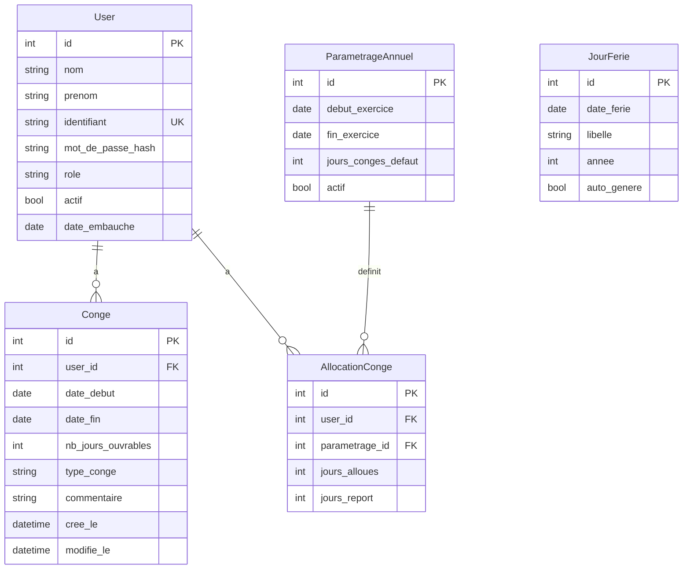

# Plan du projet Gestion des Conges - MVP (Phase 1)

## Stack technologique recommandee

Pour un site intranet destine a ~~20 salaries, avec un volume de donnees modeste (~~200-300 lignes de conges/an), la stack suivante est la plus adaptee :

- **Backend** : Python 3.13 + Flask (framework leger, ideal pour intranet)
- **Base de donnees** : SQLite (via SQLAlchemy ORM) -- pas besoin de serveur BDD separe, parfait pour ce volume
- **Frontend** : Templates Jinja2 + Tailwind CSS (CDN) + Alpine.js (interactivite legere)
- **Authentification** : Flask-Login + hash bcrypt des mots de passe
- **Deploiement** : Un seul serveur, lancement via `python app.py` ou Gunicorn

**Pourquoi cette stack ?**

- Deploiement ultra-simple sur un serveur intranet (pas de build frontend, pas de serveur BDD)
- Interface moderne grace a Tailwind CSS
- Facile a maintenir pour une petite equipe
- SQLite performant pour 20 utilisateurs concurrents

## Architecture du projet

```
Application/
  app.py                  # Point d'entree Flask
  config.py               # Configuration (secret key, DB path, etc.)
  requirements.txt        # Dependances Python
  models/
    __init__.py
    user.py               # Modele User (salarie + RH)
    conge.py              # Modele Conge
    jour_ferie.py         # Modele JourFerie
    parametrage.py        # Modele ParametrageAnnuel
  routes/
    __init__.py
    auth.py               # Login / Logout
    rh.py                 # Routes gestionnaire RH
    salarie.py            # Routes salarie
    parametrage.py        # Routes parametrage annuel
  services/
    __init__.py
    calcul_jours.py       # Calcul jours ouvrables, chevauchements
    jours_feries.py       # Chargement jours feries francais
    solde.py              # Gestion des soldes
  templates/
    base.html             # Layout commun (nav, footer)
    auth/
      login.html          # Page de connexion
    rh/
      dashboard.html      # Tableau de bord RH
      salarie_detail.html # Detail d'un salarie + historique conges
      ajouter_conge.html  # Formulaire ajout/modif conge
      parametrage.html    # Parametrage annuel + jours feries
    salarie/
      accueil.html        # Page accueil salarie (solde + conges)
  static/
    css/
      custom.css          # Styles complementaires
    js/
      app.js              # Scripts JS (Alpine.js interactions)
  seed.py                 # Script d'initialisation (admin, jours feries)
```

## Schema de base de donnees




## Fonctionnalites MVP detaillees

### 1. Authentification

- Page de connexion (identifiant + mot de passe)
- Roles : `rh` (gestionnaire) et `salarie`
- Sessions Flask-Login avec expiration apres 30 minutes d'inactivite
- Mots de passe hashes avec bcrypt (salt inclus)
- Redirection automatique selon le role apres connexion

### 2. Tableau de bord RH

- Liste de tous les salaries avec recherche
- Pour chaque salarie : solde restant, conges en cours, conges a venir
- Statistiques rapides : nombre salaries, conges en cours, conges a venir cette semaine
- Acces aux actions : ajouter/modifier/supprimer un conge

### 3. Gestion des conges (RH)

- Formulaire d'ajout : selection salarie, date debut, date fin
- Calcul automatique des jours ouvrables (exclusion week-ends + jours feries)
- Detection des chevauchements avec message d'erreur explicite
- Verification du solde suffisant avant validation
- Modification et suppression avec recalcul automatique du solde
- Historique complet par salarie en vue tableau

### 4. Parametrage annuel (RH)

- Definition de l'annee fiscale (date debut / date fin)
- Nombre de jours de conges par defaut
- Ajustement individuel par salarie (anciennete, temps partiel)
- Chargement automatique des jours feries francais (calcul Paques, Ascension, etc.)
- Possibilite d'ajouter/supprimer des jours feries manuellement
- Report automatique du solde non consomme

### 5. Interface salarie

- Page d'accueil avec solde (alloue / consomme / restant)
- Tableau de ses conges (passes et a venir)
- Aucune possibilite de modification (lecture seule)

### 6. Regles metier implementees

- Jours ouvrables : lundi-vendredi, hors jours feries
- Decrementation automatique du solde a l'ajout
- Recalcul a la modification/suppression
- Blocage si solde insuffisant
- Detection chevauchements entre conges d'un meme salarie

## Script d'initialisation (`seed.py`)

- Creation d'un compte RH par defaut (admin/admin -- a changer au premier login)
- Import des salaries depuis les donnees existantes (CSV)
- Chargement des jours feries 2025-2026
- Creation du parametrage annuel initial

## Fichiers cles a creer


| Fichier            | Description                                  |
| ------------------ | -------------------------------------------- |
| `requirements.txt` | Flask, Flask-Login, SQLAlchemy, bcrypt, etc. |
| `app.py`           | Application Flask principale                 |
| `config.py`        | Configuration (DB, secret, session timeout)  |
| `models/*.py`      | Modeles SQLAlchemy                           |
| `routes/*.py`      | Routes Flask par domaine                     |
| `services/*.py`    | Logique metier (calculs, validations)        |
| `templates/*.html` | 7-8 templates Jinja2 avec Tailwind CSS       |
| `seed.py`          | Initialisation BDD + donnees                 |


